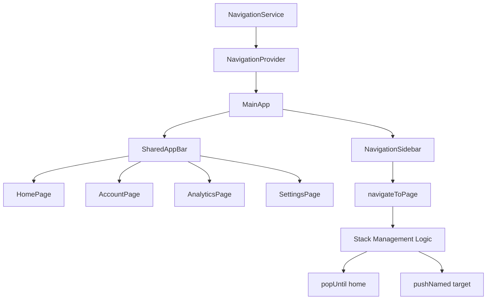
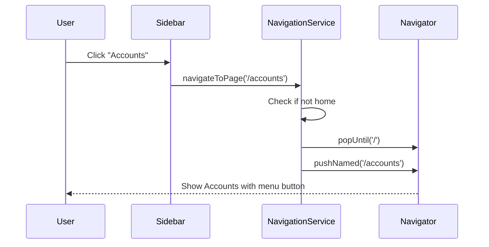

# Navigation System Refactor Plan

## Overview

This document outlines the refactoring of the Upence application's navigation system to:
1. Display a sidebar menu toggle button in the top bar instead of a back button for all pages directly accessible through the sidebar menu
2. Implement a stack management strategy where navigating to a new page via the sidebar removes the current page from the navigation history stack (if not the homepage)

## Current State Analysis

### Pages Accessible via Sidebar (Top-Level Pages)
These pages should show the **menu button** instead of a back button:
- **Home** (`/`) - The main dashboard
- **Accounts** (`/accounts`) - Bank accounts management
- **Analytics** (`/analytics`) - Analytics and reports
- **Settings** (`/settings`) - App settings

### Subpages (Not Accessible via Sidebar)
These pages should keep the **back button**:
- **UnprocessedSMSPage** - Accessed via action button/banner
- **SMSProcessingPage** - Accessed from UnprocessedSMSPage
- **CategoryManagementPage** - Accessed from Settings
- **TagManagementPage** - Accessed from Settings
- **PatternManagementPage** - Accessed from Settings

### Current Navigation Flow Issues
1. Each page has its own `AppBar` with a default back button
2. Sidebar navigation uses `pushNamed()` which adds to the stack
3. No stack management - users can navigate deep into the stack
4. HomePage uses MainApp's AppBar, but other pages have their own

## Architecture Design

### Component Overview



### Navigation Flow



## Implementation Plan

### 1. Create Navigation Service

**File:** `lib/services/navigation_service.dart`

A Riverpod provider that handles:
- Navigation to sidebar-accessible pages
- Stack management (pop to home before pushing)
- Determining if a route is a sidebar page
- Tracking the current route

**Key Methods:**
- `navigateToSidebarPage(BuildContext context, String route)` - Main navigation method
- `isSidebarPage(String route)` - Check if route is accessible via sidebar
- `getCurrentRoute(BuildContext context)` - Get the current route name

### 2. Create Shared AppBar Widget

**File:** `lib/core/widgets/shared_app_bar.dart`

A reusable `AppBar` widget that:
- Shows menu button when the page is a sidebar page
- Shows back button when the page is a subpage
- Accepts title and optional actions
- Integrates with the NavigationService

**Features:**
- `title` - The AppBar title
- `actions` - Optional list of widgets for the actions area
- `scaffoldKey` - GlobalKey for opening the drawer

### 3. Update NavigationSidebar

**File:** `lib/core/widgets/navigation_sidebar.dart`

Changes:
- Import and use `NavigationService`
- Replace `navigator.pushNamed()` with `NavigationService.navigateToSidebarPage()`
- Keep the drawer close behavior

### 4. Update MainApp

**File:** `lib/main.dart`

Changes:
- Add `NavigationProvider` to the provider scope
- Update the `_buildMainPage()` to use the new navigation system
- Keep the drawer reference

### 5. Update Top-Level Pages

Each sidebar-accessible page needs to:
- Replace its custom `AppBar` with `SharedAppBar`
- Pass the `scaffoldKey` to enable drawer opening
- Keep existing body and functionality

**Files to update:**
- `lib/features/home/presentation/home_page.dart`
- `lib/features/accounts/presentation/account_page.dart`
- `lib/features/analytics/presentation/analytics_page.dart`
- `lib/features/settings/presentation/settings_page.dart`

### 6. Subpages (No Changes Required)

Subpages should continue using their standard `AppBar` with back button:
- `UnprocessedSMSPage` - Already has proper AppBar
- `SMSProcessingPage` - Check if it needs AppBar
- `CategoryManagementPage` - Uses BaseManagementPage
- `TagManagementPage` - Uses BaseManagementPage
- `PatternManagementPage` - Uses BaseManagementPage

## Stack Management Logic

### Algorithm

```
function navigateToSidebarPage(targetRoute):
    currentRoute = getCurrentRoute()
    
    if currentRoute == '/' and targetRoute == '/':
        return  // Already on home
    
    if currentRoute != '/':
        // Remove all non-home pages from stack
        popUntil('/')
    
    if targetRoute != '/':
        // Navigate to target
        pushNamed(targetRoute)
```

### Example Navigation Flows

**Scenario 1: Home → Accounts**
- Current: `/`
- Action: `pushNamed('/accounts')`
- Stack: `[/, /accounts]`

**Scenario 2: Accounts → Analytics**
- Current: `/accounts`
- Action: `popUntil('/')` → `pushNamed('/analytics')`
- Stack: `[/, /analytics]`

**Scenario 3: Settings → Home**
- Current: `/settings`
- Action: `popUntil('/')`
- Stack: `[/]`

**Scenario 4: Home → UnprocessedSMSPage (Subpage)**
- Current: `/`
- Action: `push(UnprocessedSMSPage)` (standard navigation)
- Stack: `[/, UnprocessedSMSPage]`
- Result: Subpage shows back button (not menu button)

## File Structure

```
lib/
├── services/
│   └── navigation_service.dart          [NEW]
├── core/
│   ├── widgets/
│   │   ├── navigation_sidebar.dart      [MODIFY]
│   │   └── shared_app_bar.dart          [NEW]
│   └── providers/
│       └── app_providers.dart           [MODIFY - add navigation provider]
├── features/
│   ├── home/
│   │   └── presentation/
│   │       └── home_page.dart           [MODIFY]
│   ├── accounts/
│   │   └── presentation/
│   │       └── account_page.dart        [MODIFY]
│   ├── analytics/
│   │   └── presentation/
│   │       └── analytics_page.dart      [MODIFY]
│   └── settings/
│       └── presentation/
│           └── settings_page.dart       [MODIFY]
└── main.dart                             [MODIFY]
```

## Testing Checklist

- [ ] Home page shows menu button
- [ ] Accounts page shows menu button
- [ ] Analytics page shows menu button
- [ ] Settings page shows menu button
- [ ] UnprocessedSMSPage shows back button
- [ ] SMSProcessingPage shows back button
- [ ] CategoryManagementPage shows back button
- [ ] TagManagementPage shows back button
- [ ] PatternManagementPage shows back button
- [ ] Navigation from Home → Accounts works correctly
- [ ] Navigation from Accounts → Analytics clears previous page from stack
- [ ] Navigation from Settings → Home clears previous pages from stack
- [ ] Menu button opens drawer on all sidebar pages
- [ ] Back button works correctly on subpages
- [ ] Deep navigation (Home → Accounts → Settings → Analytics) maintains only 2 levels in stack

## Edge Cases

1. **User is on a subpage and clicks sidebar menu item**
   - Should pop to home first, then navigate to target
   - Current behavior: Will need to handle this case

2. **User presses Android back button**
   - Should behave as expected (pop to previous page)
   - Stack management only affects sidebar navigation

3. **Drawer open and user navigates via sidebar**
   - Drawer should close before navigation

4. **Routes not defined in sidebar**
   - Should use standard navigation (push)
   - Will show back button

## Migration Notes

- No database changes required
- No API changes required
- Existing navigation within subpages remains unchanged
- Only sidebar-accessible pages are affected
