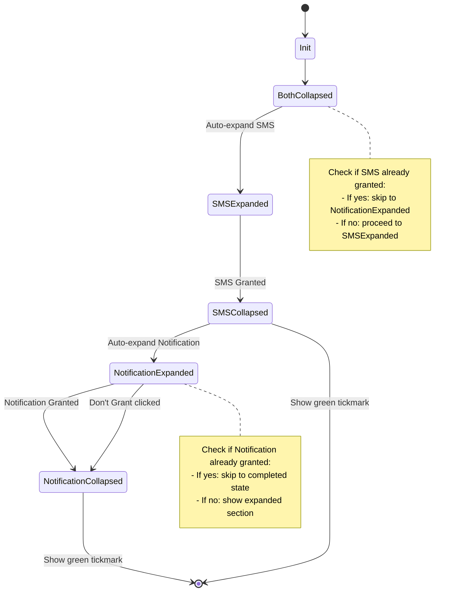

# Permission Accordion Interface Design

## Overview
Design a background-integrated permission interface for SMS and Notifications with an exclusive accordion mechanism.

## Requirements Summary

1. **Two distinct sections without a containing card** - Remove Card widget wrapper
2. **Exclusive accordion mechanism** - Only one section can be expanded at a time
3. **No manual collapse** - Users cannot manually collapse an active section
4. **Auto-expand SMS on init** - Both sections start collapsed, then SMS auto-expands
5. **SMS granted flow** - Collapse SMS, show green tickmark, auto-expand Notification
6. **"Don't Grant" option** - In Notification section, enables Next button
7. **Skip granted permissions** - Don't open sections for already-granted permissions

## Architecture Design

### 1. State Management Changes (SetupViewModel)

#### New State Properties
```dart
class SetupState {
  // ... existing properties ...
  
  // Accordion expansion state: 'SMS', 'Notifications', or null (none expanded)
  final String? expandedSection;
  
  // Flag to track if user chose "Don't Grant" for notifications
  final bool notificationDonGrantSelected;
}
```

#### New Methods
```dart
// Set the expanded section (exclusive accordion)
void setExpandedSection(String? section);

// Handle "Don't Grant" selection for notifications
void setNotificationDonGrant(bool value);

// Override requestPermissions to handle auto-expansion logic
Future<void> requestPermissions(String type) async {
  // ... existing permission request logic ...
  
  // Auto-expand/collapse logic
  if (type == "SMS" && smsGranted) {
    setExpandedSection(null); // Collapse SMS
    // Notification will auto-expand based on logic
  }
}
```

### 2. UI Component Architecture

#### PermissionsPage Structure
```
PermissionsPage (ConsumerStatefulWidget)
├── Padding (no Card wrapper)
│   └── Column
│       ├── Header (Title + Description)
│       ├── SMS Permission Section
│       │   ├── Collapsed State: Icon + Title + (Green Tick if granted)
│       │   └── Expanded State: Description + Info Box + Grant Button
│       ├── Notification Permission Section
│       │   ├── Collapsed State: Icon + Title + (Green Tick if granted)
│       │   └── Expanded State: Description + Info Box + Grant Button + "Don't Grant" Button
│       └── Spacer (for background integration)
```

#### Accordion Section Component
```dart
class _PermissionAccordionSection extends StatelessWidget {
  final IconData icon;
  final String title;
  final String description;
  final String infoText;
  final AppPermissionStatus permissionStatus;
  final bool isExpanded;
  final bool showDonGrantOption;
  final VoidCallback onGrant;
  final VoidCallback onDonGrant;
  final bool donGrantSelected;
}
```

### 3. Flow Diagram



### 4. Detailed Component Specifications

#### Collapsed State
- Layout: Row with Icon + Title + (Optional Green Tick)
- Styling: Minimal, no card, background-transparent
- Green Tick: Shown when permission is granted

#### Expanded State
- Layout: Column with:
  - Icon + Title (same as collapsed)
  - Description text
  - Info box with warning icon
  - Action buttons (Grant / Don't Grant)
- Styling: No Card widget, direct padding
- Animation: Smooth expansion transition

#### Green Tickmark Indicator
- Icon: Icons.check_circle
- Color: Colors.green
- Size: 24px
- Position: Right side of collapsed row

#### "Don't Grant" Button
- Style: TextButton or OutlinedButton (secondary)
- Text: "Don't Grant"
- Action: Sets notificationDonGrantSelected flag, enables Next button

### 5. State Transitions

#### Initial Load
```
1. Check permissions
2. If SMS granted: expandedSection = 'Notifications'
3. If both granted: expandedSection = null
4. If SMS not granted: expandedSection = 'SMS'
```

#### After SMS Grant
```
1. Update SMS permission status to granted
2. expandedSection = null (collapse SMS)
3. After animation delay: expandedSection = 'Notifications'
```

#### After Notification Grant
```
1. Update Notification permission status to granted
2. expandedSection = null (collapse Notification)
3. Show green tickmark
```

#### After "Don't Grant" Click
```
1. notificationDonGrantSelected = true
2. expandedSection = null (collapse Notification)
3. Enable Next button
```

### 6. canProceedFromCurrentStep() Logic Update

```dart
bool canProceedFromCurrentStep() {
  switch (state.currentStep) {
    case SetupStep.permissions:
      final smsGranted = state.permissionsGranted['SMS'] == AppPermissionStatus.granted;
      final notificationGranted = state.permissionsGranted['Notifications'] == AppPermissionStatus.granted;
      final donGrantSelected = state.notificationDonGrantSelected;
      
      // Proceed if SMS is granted AND (Notification granted OR Don't Grant selected)
      return smsGranted && (notificationGranted || donGrantSelected);
    // ... other cases ...
  }
}
```

### 7. Implementation Checklist

- [ ] Add `expandedSection` to SetupState
- [ ] Add `notificationDonGrantSelected` to SetupState
- [ ] Add `setExpandedSection()` method to SetupViewModel
- [ ] Add `setNotificationDonGrant()` method to SetupViewModel
- [ ] Update `canProceedFromCurrentStep()` logic
- [ ] Remove Card widget from PermissionsPage
- [ ] Create `_PermissionAccordionSection` widget
- [ ] Implement collapsed state UI
- [ ] Implement expanded state UI
- [ ] Add green tickmark indicator
- [ ] Add "Don't Grant" button
- [ ] Implement auto-expansion logic in initState
- [ ] Implement auto-expansion after SMS grant
- [ ] Test flow with both permissions granted
- [ ] Test flow with SMS already granted
- [ ] Test flow with "Don't Grant" selection
- [ ] Test flow with permanent denial (Settings button)

### 8. Visual Design Notes

#### Color Scheme
- Background: Transparent (background-integrated)
- Info Box: Yellow border (Colors.yellow.shade600)
- Green Tick: Colors.green
- Grant Button: Primary color
- Don't Grant Button: Secondary/Text button

#### Spacing
- Section spacing: 16px
- Padding within sections: 12-16px
- Info box margin: 4px

#### Typography
- Title: headlineSmall with FontWeight.w500
- Description: bodyMedium
- Info text: bodyMedium

### 9. Edge Cases

1. **Both permissions already granted**: No section should expand, show both green ticks
2. **SMS already granted, Notification not**: Expand Notification section only
3. **Permanent denial**: Show "Settings" button instead of "Grant"
4. **User navigates away and back**: Restore expansion state based on permission status
5. **Permission status changes externally**: Listen to lifecycle events and update UI

### 10. Files to Modify

1. `lib/views/setup/setup_view_model.dart`
   - Add new state properties
   - Add new methods
   - Update `canProceedFromCurrentStep()`

2. `lib/views/setup/widgets/permissions_page.dart`
   - Complete redesign
   - Remove Card widget
   - Implement accordion mechanism
   - Add auto-expansion logic
